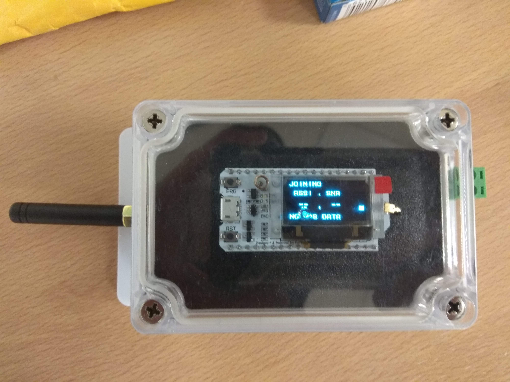
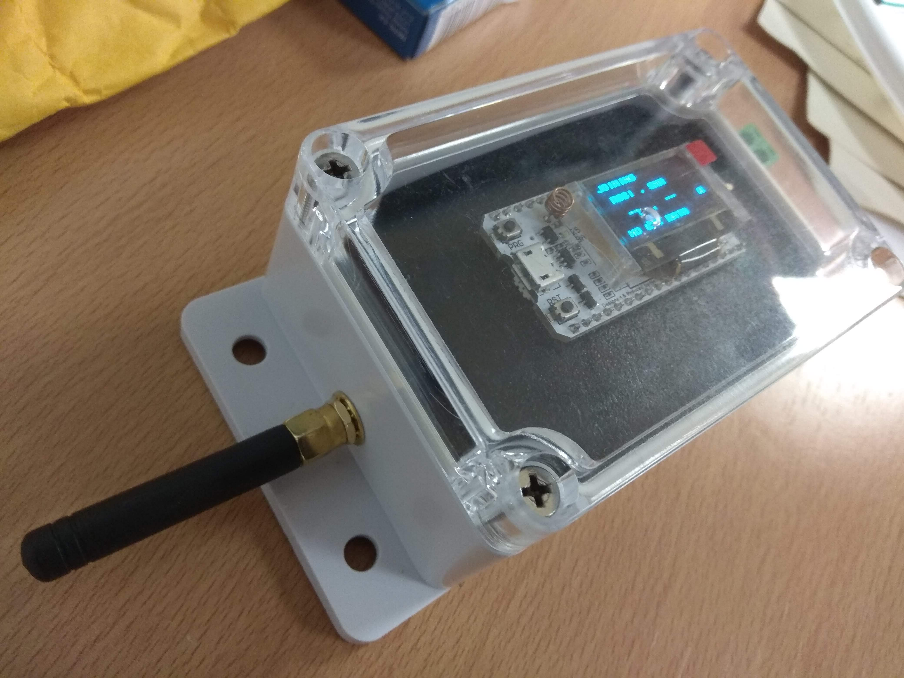
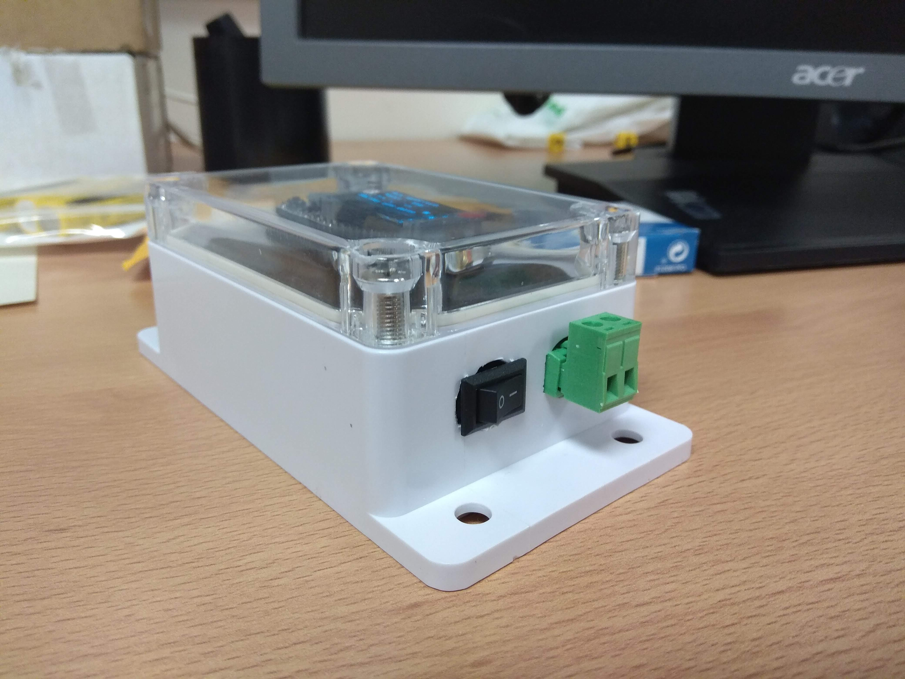
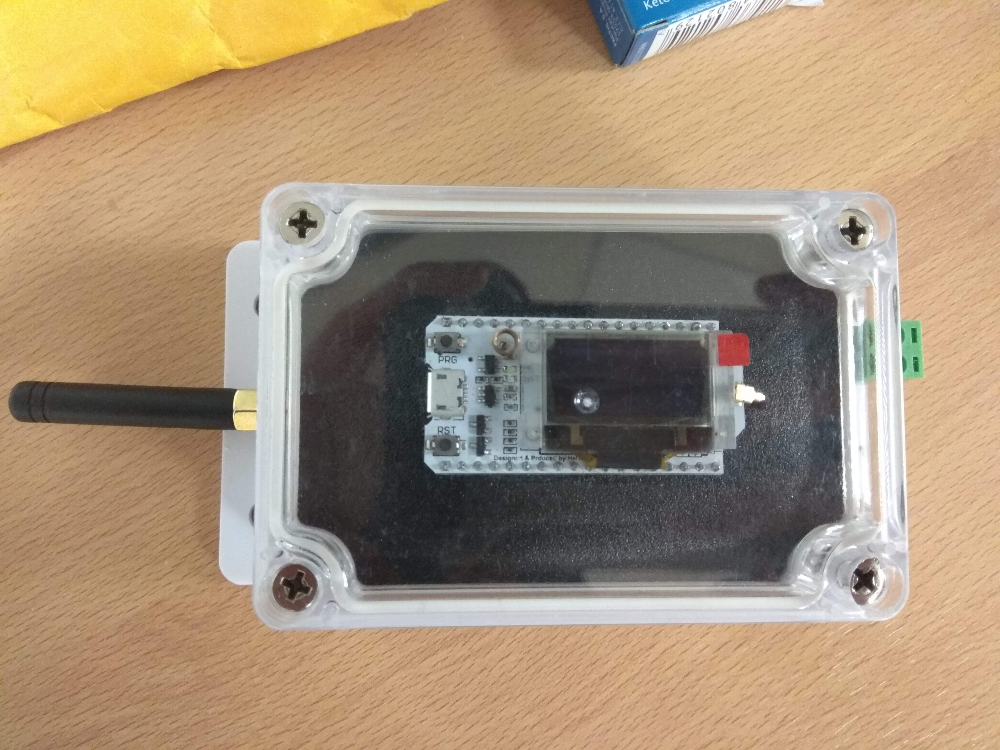

# LoRa Coverage Analyzer

Device that reports data for the TTN LoRa coverage analysis. It sends GPS, RSSI, and SNR data to the TTN application requiring an ACK. On received ACK, RSSI and SNR are shown on the OLED screen.

